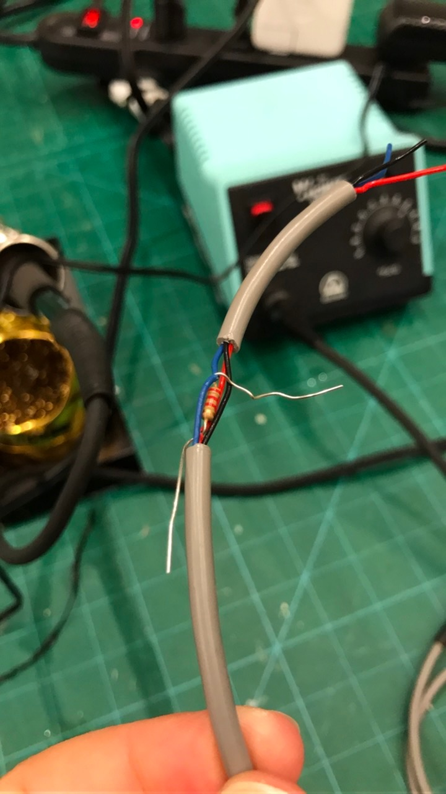

#Prototype Fermentabot
The v1 fermentabot does environmental control and sensing for fermentation. It marries the [simple fermentation box](https://github.com/ariellejohnson/simple-fermentation-box) and other designs for fermentation environments and the OpenAg [brain box](https://github.com/OpenAgInitiative/openag_brain_box).

The brain box has sensors for:
- air temperature
- humidity
- substrate temperature
- oxygen
- carbon dioxide
- pH
- electrical conductivity

 The brain box can actuate these features in the fermentabot:
- heater
- humidifier

 The brain box was designed to be able to control environmentally complex koji fermentations, which require both temperature and humidity control, as well as to work with simpler fermentations (such as lactic fermentation of vegetables or miso) where temperature and user-added salt content are primary control points.

 The main components of the fermentabot are:
- brain box + sensors
- incubator lid (lexan restaurant container lid, sensors pass through a cable gland in the lid)
- incubator box (Clear Food Storage Box 18in x 26in x 15in:lexan restaurant container)
- insulation (reflectix layer wrapped around clearfood storage box)
- heater (48in x 20.75in Seedling Heat Mat, sandwiched in between insulation layer and incubator box, actuated by brain box)
- humidifier (Reptile Fogger Terrarium Humidifier, humidifies incubator through port in lid, actuated by brain box)

# Preparing the incubator chamber
- wrap the 48in x 20.75in Seedling Heat Mat around the long sides and bottom of the lexan Clear Food Storage Box and secure in place with VHB tape. Place the heat mat so that the power cord is on the side you will be plugging the fermentabot to electrical power.
- cover the bottom and sides of the Clear Food Storage Box + Seedling Heat Mat with a layer of reflectix insulation and secure with aluminum foil tape.
- about 1 foot down from where the cord meets the heating mat, cut one of the two wires of the heating mat power cord, strip the two ends, and connectorize them with 16 AWG Tin Contact Crimp Pins into one 2 Position Rectangular Housing Connector Plug so that they can be mated with one of the relay outputs inside the brain box. (photo TK)
- connectorize one wire of the humidifier power cord in the same fashion
- drill two holes in the 18in x 26in Clear Flat Lid for Food Storage Box, one for the cable gland and one for the PVC tubing that the humidifier feed tube will attach to.

# Prototype Wiring Instructions

## Connectorize the AM2315 Temperature & Humidity Sensor

-------------------------------------------------------

## Connectorize the MHZ16 CO2 Sensor

-------------------------------------------------------

## Connectorize the Grove O2 Sensor

## Connect Grove O2 Sensor to USB GPIO Board

-------------------------------------------------------

## Connectorize the Relay

------------------------------------------------------

## Connectorize the IDC Cable

### IDC Cable 4-Conn Female

### IDC Cable 4-Conn Male

### IDC Cable 2-Conn

### IDC Cable 6-Conn

### Install the resistor onto the temperature sensor

-------------------------------------------------------

### Pass the connectorized sensors through the cable gland in the lid of the fermentabot chamber:
- Grove O2 Sensor
- AM2315 Temperature & Humidity Sensor
- MHZ16 CO2 Sensor
- DS18B20 Temperature Sensor
- pH sensor (aleady has BNC connector, do not re-connectorize)
- EC sensor (aleady has BNC connector, do not re-connectorize)

## Connect IDC Cable to Components

### IDC Cable to I2C Extender

### IDC Cable to DS18B20

### IDC Cable to Relay

### IDC Cable to LED

-------------------------------------------------------
